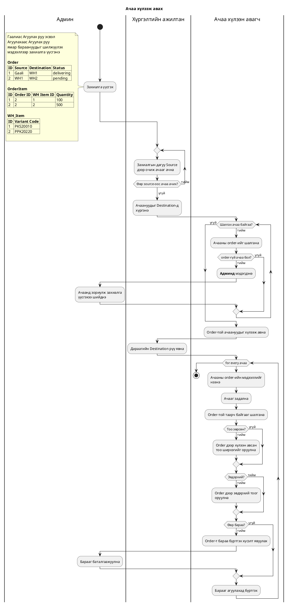

# Inbound Process

```plantuml
@startuml

title Ачаа хүлээж авах
|Админ|
start
:Захиалга үүсгэх;

note left
Гаалиас Агуулах руу эсвэл
Агуулахаас Агуулах руу
ямар бараануудыг шилжүүлэх
мэдээллээр захиалга үүсгэнэ

**Order**
|= ID |= Source |= Destination |= Status |
| 1 | Gaali | WH1 | delivering |
| 2 | WH1 | WH2 | pending |

**OrderItem**
|= ID |= Order ID |= WH Item ID |= Quantity |
| 1 | 2 | 1 | 100 |
| 2 | 2 | 2 | 500 |

**WH_Item**
|= ID |= Variant Code |
| 1 | PKS20010 |
| 2 | PPK20220 |

end note

|Хүргэлтийн ажилтан|
repeat
  :Захиалгын дагуу Source
  дээр очиж ачааг ачна;
repeat while (Өөр source-оос ачаа ачих?) is (тийм)
->үгүй;
:Ачаануудыг Destination-д
хүргэнэ;
|Ачаа хүлээн авагч|
while (Шалгах ачаа байгаа?) is (тийм)
  :Ачааны order-ийг шалгана;
  if (order-гүй ачаа бол?) then (тийм)
    :**Админд** мэдэгдэнэ;
    |Админ|
    :Ачаанд зориулж захиалга
    үүсгэхээ шийднэ;
  else (үгүй)
  endif
endwhile (үгүй)
|Ачаа хүлээн авагч|
:Order-той ачаануудыг хүлээж авна;
|Хүргэлтийн ажилтан|
:Дараагийн Destination рүү явна;
|Ачаа хүлээн авагч|
while (for every ачаа)
  :Ачааны order-ийн мэдээллийг
  нээнэ;
  :Ачааг задална;
  :Order-той таарч байгааг шалгана;
  if (Тоо зөрсөн?) then (тийм)
    :Order дээр хүлээн авсан
    тоо ширхэгийг оруулна;
  else (үгүй)
  endif
  if (Эвдэрхий?) then (тийм)
    :Order дээр эвдэрхий тоог
    оруулна;
  else (тийм)
  endif
  if (Өөр бараа?) then (тийм)
    :Order-т бараа бүртгэх хүсэлт явуулах;
    |Админ|
    :Барааг баталгаажуулна;
  else (үгүй)
  endif
  |Ачаа хүлээн авагч|
  :Барааг агуулахад бүртгэх;
endwhile
stop
@enduml
```
