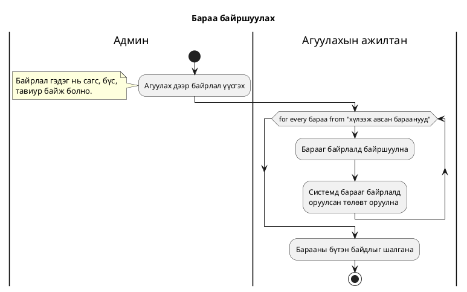

# Бараа байршуулах процесс

```plantuml
@startuml
title Бараа байршуулах
|admin|Админ
start
:Агуулах дээр байрлал үүсгэх;
note left
    Байрлал гэдэг нь сагс, бүс,
    тавиур байж болно.
endnote
|staff|Агуулахын ажилтан
while (for every бараа from "хүлээж авсан бараанууд")
    :Барааг байрлалд байршуулна;
    :Системд барааг байрлалд
    оруулсан төлөвт оруулна;
endwhile
:Барааны бүтэн байдлыг шалгана;
stop
@enduml
```
