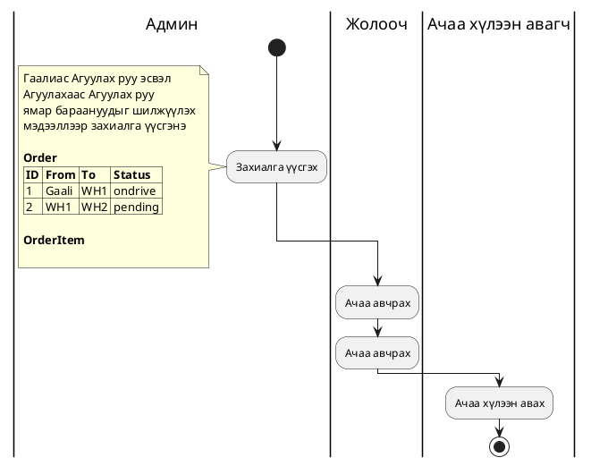

# Activity Diagram

asdfasdf asdf

```plantuml
@startuml
|Админ|
start
:Захиалга үүсгэх;
note left
Гаалиас Агуулах руу эсвэл
Агуулахаас Агуулах руу
ямар бараануудыг шилжүүлэх
мэдээллээр захиалга үүсгэнэ

**Order**
|= ID |= From |= To |= Status |
| 1 | Gaali | WH1 | ondrive |
| 2 | WH1 | WH2 | pending |

**OrderItem**

end note
|Жолооч|
:Ачаа авчрах;
:Ачаа авчрах;
|Ачаа хүлээн авагч|
:Ачаа хүлээн авах;
stop
@enduml
```
