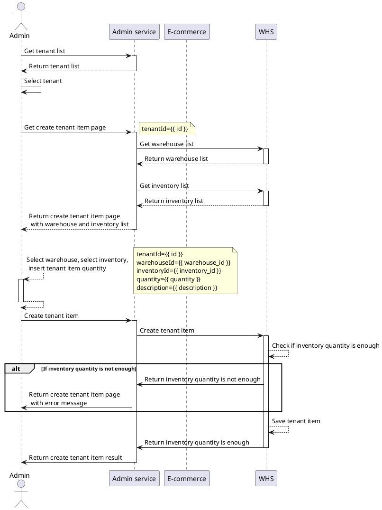

### Admin warehouse tenant item sequence diagram 

```plantuml

@startuml
actor "Admin" as admin
participant "Admin service" as adminService
participant "E-commerce" as ecom
participant "WHS" as whs

admin -> adminService ++: Get tenant list
adminService --> admin --: Return tenant list

admin -> admin: Select tenant

|||
|||

admin -> adminService ++: Get create tenant item page
note right
    tenantId={{ id }}
end note
adminService -> whs ++: Get warehouse list
whs --> adminService --: Return warehouse list
|||

adminService -> whs ++: Get inventory list
whs --> adminService --: Return inventory list
adminService --> admin --: Return create tenant item page \n with warehouse and inventory list

|||

admin --> admin ++: Select warehouse, select inventory,\n insert tenant item quantity

note right
    tenantId={{ id }}
    warehouseId={{ warehouse_id }}
    inventoryId={{ inventory_id }}
    quantity={{ quantity }}
    description={{ description }}
end note

admin --> admin --:
admin -> adminService ++: Create tenant item
adminService -> whs ++: Create tenant item
whs --> whs: Check if inventory quantity is enough

alt If inventory quantity is not enough
    whs -> adminService: Return inventory quantity is not enough
    adminService -> admin: Return create tenant item page \n with error message
end

whs --> whs: Save tenant item 
whs -> adminService --: Return inventory quantity is enough
adminService -> admin --: Return create tenant item result

@enduml
```