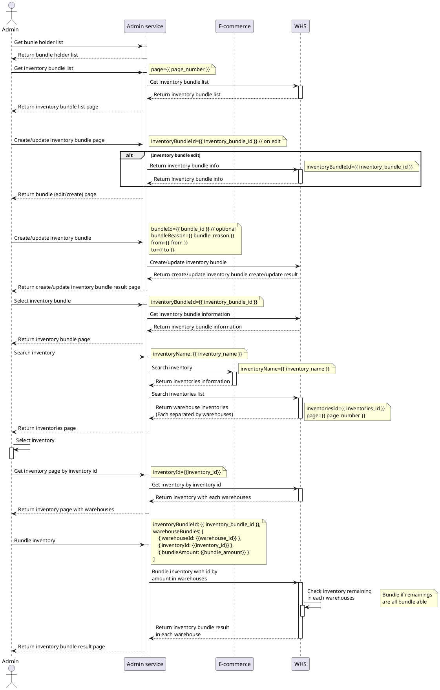

### Admin inventory bundle sequence diagram 

```plantuml

@startuml
actor "Admin" as admin
participant "Admin service" as adminService
participant "E-commerce" as ecom
participant "WHS" as whs

!$bundleedStatus = "LOCKED"
!$bundleRequestStatus = "LOCKED"

admin -> adminService ++: Get bunle holder list
adminService --> admin --: Return bundle holder list

admin -> adminService ++: Get inventory bundle list
note right
    page={{ page_number }}
end note
adminService -> whs ++: Get inventory bundle list
whs -->adminService --: Return inventory bundle list
adminService --> admin: Return inventory bundle list page

|||
|||

admin -> adminService: Create/update inventory bundle page
note right
    inventoryBundleId={{ inventory_bundle_id }} // on edit
end note
alt Inventory bundle edit
    adminService -> whs ++: Return inventory bundle info
    note right
        inventoryBundleId={{ inventory_bundle_id }}
    end note
    whs --> adminService --: Return inventory bundle info
end
adminService --> admin : Return bundle (edit/create) page

|||
|||

admin -> adminService: Create/update inventory bundle
note right
    bundleId={{ bundle_id }} // optional
    bundleReason={{ bundle_reason }}
    from={{ from }}
    to={{ to }}
end note
adminService -> whs: Create/update inventory bundle
whs --> adminService: Return create/update inventory bundle create/update result
adminService --> admin --: Return create/update inventory bundle result page

admin -> adminService ++: Select inventory bundle
note right
    inventoryBundleId={{ inventory_bundle_id }}
end note
adminService -> whs: Get inventory bundle information
whs --> adminService: Return inventory bundle information
adminService --> admin: Return inventory bundle page

admin -> adminService ++: Search inventory
note right
    inventoryName: {{ inventory_name }}
end note
adminService -> ecom ++: Search inventory
note right
    inventoryName={{ inventory_name }}
end note
ecom --> adminService--: Return inventories information


adminService -> whs ++: Search inventories list
whs --> adminService --: Return warehouse inventories \n(Each separated by warehouses)
note right
    inventoriesId={{ inventories_id }}
    page={{ page_number }}
end note
adminService --> admin --: Return inventories page
admin -> admin ++--: Select inventory
admin -> adminService ++: Get inventory page by inventory id
note right
    inventoryId={{inventory_id}}
end note
adminService -> whs ++: Get inventory by inventory id
whs --> adminService --: Return inventory with each warehouses
adminService --> admin --: Return inventory page with warehouses
admin -> adminService ++: Bundle inventory
note right
    inventoryBundleId: {{ inventory_bundle_id }},
    warehouseBundles: [
        { warehouseId: {{warehouse_id}} },
        { inventoryId: {{inventory_id}} },
        { bundleAmount: {{bundle_amount}} }
    ]
end note
adminService -> whs ++: Bundle inventory with id by \namount in warehouses
whs -> whs ++--: Check inventory remaining\nin each warehouses
note right
    Bundle if remainings
    are all bundle able
end note
whs --> adminService--: Return inventory bundle result\nin each warehouse
adminService --> admin: Return inventory bundle result page

@enduml
```