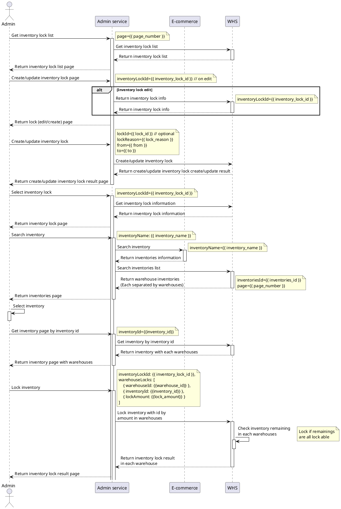

### Admin inventory lock sequence diagram 

```plantuml

@startuml
actor "Admin" as admin
participant "Admin service" as adminService
participant "E-commerce" as ecom
participant "WHS" as whs

!$lockedStatus = "LOCKED"
!$lockRequestStatus = "LOCKED"

admin -> adminService ++: Get inventory lock list
note right
    page={{ page_number }}
end note
adminService -> whs ++: Get inventory lock list
whs -->adminService --: Return inventory lock list
adminService --> admin: Return inventory lock list page

admin -> adminService: Create/update inventory lock page
note right
    inventoryLockId={{ inventory_lock_id }} // on edit
end note
alt Inventory lock edit
    adminService -> whs ++: Return inventory lock info
    note right
        inventoryLockId={{ inventory_lock_id }}
    end note
    whs --> adminService --: Return inventory lock info
end
adminService --> admin : Return lock (edit/create) page

admin -> adminService: Create/update inventory lock
note right
    lockId={{ lock_id }} // optional
    lockReason={{ lock_reason }}
    from={{ from }}
    to={{ to }}
end note
adminService -> whs: Create/update inventory lock
whs --> adminService: Return create/update inventory lock create/update result
adminService --> admin --: Return create/update inventory lock result page

admin -> adminService ++: Select inventory lock
note right
    inventoryLockId={{ inventory_lock_id }}
end note
adminService -> whs: Get inventory lock information
whs --> adminService: Return inventory lock information
adminService --> admin: Return inventory lock page

admin -> adminService ++: Search inventory
note right
    inventoryName: {{ inventory_name }}
end note
adminService -> ecom ++: Search inventory
note right
    inventoryName={{ inventory_name }}
end note
ecom --> adminService--: Return inventories information


adminService -> whs ++: Search inventories list
whs --> adminService --: Return warehouse inventories \n(Each separated by warehouses)
note right
    inventoriesId={{ inventories_id }}
    page={{ page_number }}
end note
adminService --> admin --: Return inventories page
admin -> admin ++--: Select inventory
admin -> adminService ++: Get inventory page by inventory id
note right
    inventoryId={{inventory_id}}
end note
adminService -> whs ++: Get inventory by inventory id
whs --> adminService --: Return inventory with each warehouses
adminService --> admin --: Return inventory page with warehouses
admin -> adminService ++: Lock inventory
note right
    inventoryLockId: {{ inventory_lock_id }},
    warehouseLocks: [
        { warehouseId: {{warehouse_id}} },
        { inventoryId: {{inventory_id}} },
        { lockAmount: {{lock_amount}} }
    ]
end note
adminService -> whs ++: Lock inventory with id by \namount in warehouses
whs -> whs ++--: Check inventory remaining\nin each warehouses
note right
    Lock if remainings
    are all lock able
end note
whs --> adminService--: Return inventory lock result\nin each warehouse
adminService --> admin: Return inventory lock result page

@enduml
```