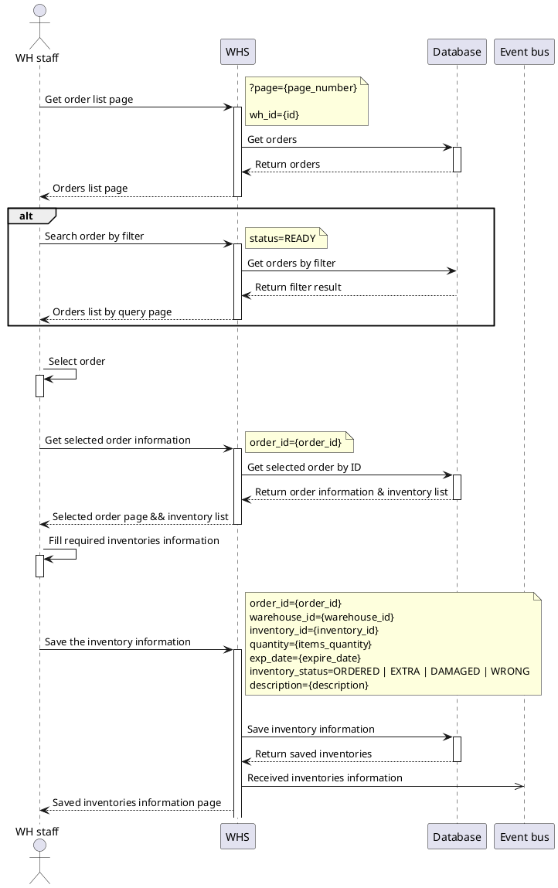

### Inventory receive sequence diagram

```plantuml

@startuml
actor "WH staff" as staff
participant "WHS" as whs
participant "Database" as db
participant "Event bus" as eb

!$orderStatusReady = "READY"
!$statusReceived = "RECEIVED"
!$inventoryStatusOrdered = "ORDERED"
!$inventoryStatusExtra = "EXTRA"
!$inventoryStatusDamaged = "DAMAGED"
!$inventoryStatusOrdered = "ORDERED"
!$inventoryStatusWrong = "WRONG"

staff -> whs ++: Get order list page
note right
    ?page={page_number}

    wh_id={id}
end note
whs -> db ++: Get orders
db --> whs --: Return orders
whs --> staff --: Orders list page

alt 
    staff -> whs ++: Search order by filter
    note right
        status=$orderStatusReady
    end note
    whs -> db : Get orders by filter
    db --> whs: Return filter result
    whs --> staff --: Orders list by query page
end

|||

staff -> staff ++--: Select order

|||

staff -> whs ++: Get selected order information
note right
    order_id={order_id}
end note
whs -> db ++: Get selected order by ID
db --> whs --: Return order information & inventory list
whs --> staff --: Selected order page && inventory list

staff -> staff ++--: Fill required inventories information

staff -> whs++: Save the inventory information
note right
    order_id={order_id}
    warehouse_id={warehouse_id}
    inventory_id={inventory_id}
    quantity={items_quantity}
    exp_date={expire_date}
    inventory_status=$inventoryStatusOrdered | $inventoryStatusExtra | $inventoryStatusDamaged | $inventoryStatusWrong
    description={description}
end note

|||

whs -> db ++: Save inventory information
db --> whs --: Return saved inventories
whs ->> eb: Received inventories information
whs --> staff: Saved inventories information page

@enduml
```
