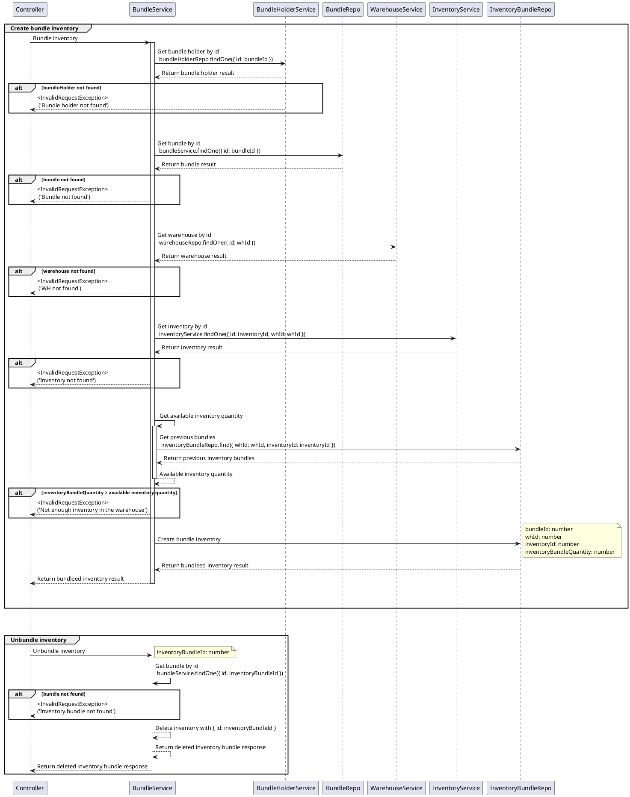

##### Inventory receive - Bundle inventory sequence diagram 

```plantuml
@startuml

participant "Controller" as controller
participant "BundleService" as bundleService
participant "BundleHolderService" as bundleHolderService
participant "BundleRepo" as bundleRepo
participant "WarehouseService" as warehouseService
participant "InventoryService" as inventoryService
participant "InventoryBundleRepo" as inventoryBundleRepo

group Create bundle inventory
    controller -> bundleService ++: Bundle inventory

    bundleService -> bundleHolderService: Get bundle holder by id \n bundleHolderRepo.findOne({ id: bundleId })

    bundleHolderService --> bundleService: Return bundle holder result

        alt bundleHolder not found
        bundleHolderService --> controller: <InvalidRequestException> \n ('Bundle holder not found')
    end

    |||
    |||

    bundleService -> bundleRepo: Get bundle by id \n bundleService.findOne({ id: bundleId })
    
    bundleRepo --> bundleService: Return bundle result

    alt bundle not found
        bundleService --> controller: <InvalidRequestException> \n ('Bundle not found')
    end

    |||
    |||

    bundleService -> warehouseService: Get warehouse by id \n warehouseRepo.findOne({ id: whId })

    warehouseService --> bundleService: Return warehouse result

    alt warehouse not found
        bundleService --> controller: <InvalidRequestException> \n ('WH not found')
    end


    |||
    |||

    bundleService -> inventoryService: Get inventory by id \n inventoryService.findOne({ id: inventoryId, whId: whId })

    inventoryService --> bundleService: Return inventory result

    alt
        bundleService --> controller: <InvalidRequestException> \n('Inventory not found')
    end


    |||
    |||

    ' bundleService -> inventoryBundleRepo: inventoryBundleRepo.findOne({ whId: whId, inventoryId: inventoryId })
    ' inventoryBundleRepo --> bundleService: InventoryBundle

    ' inventoryBundleRepo --> bundleService: InventoryBundles 

    bundleService -> bundleService ++: Get available inventory quantity
    bundleService -> inventoryBundleRepo: Get previous bundles \n inventoryBundleRepo.find({ whId: whId, inventoryId: inventoryId })
    inventoryBundleRepo --> bundleService: Return previous inventory bundles
    bundleService --> bundleService --: Available inventory quantity

    alt inventoryBundleQuantity > available inventory quantity
        bundleService --> controller: <InvalidRequestException> \n('Not enough inventory in the warehouse')
    end

    bundleService -> inventoryBundleRepo: Create bundle inventory

    note right
        bundleId: number
        whId: number
        inventoryId: number
        inventoryBundleQuantity: number
    end note

    inventoryBundleRepo --> bundleService: Return bundleed inventory result

    bundleService --> controller --: Return bundleed inventory result

    |||
    |||
end

|||
|||

group Unbundle inventory
    controller -> bundleService: Unbundle inventory

    note right
        inventoryBundleId: number
    end note

    bundleService -> bundleService: Get bundle by id \n bundleService.findOne({ id: inventoryBundleId })

    alt bundle not found
        bundleService --> controller: <InvalidRequestException> \n('Inventory bundle not found')
    end

    bundleService --> bundleService: Delete inventory with { id: inventoryBundleId }

    bundleService --> bundleService: Return deleted inventory bundle response

    bundleService --> controller: Return deleted inventory bundle response
end

@enduml
```