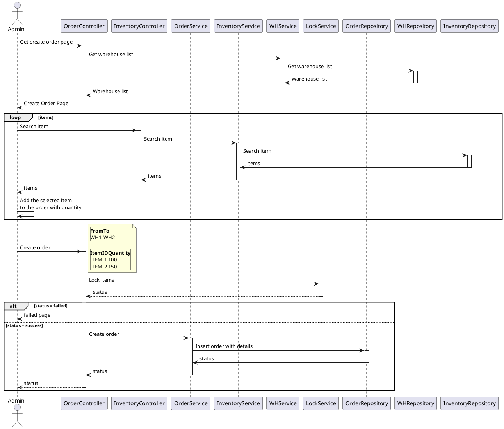

# Create Order

```plantuml

@startuml

actor Admin
participant OrderController
participant InventoryController
participant OrderService
participant InventoryService
participant WHService
participant LockService
participant OrderRepository
participant WHRepository
participant InventoryRepository

Admin -> OrderController ++: Get create order page
OrderController -> WHService ++: Get warehouse list
WHService -> WHRepository ++: Get warehouse list
WHRepository -> WHService --: Warehouse list
WHService --> OrderController --: Warehouse list
OrderController --> Admin --: Create Order Page

loop items
    Admin -> InventoryController ++: Search item
    InventoryController -> InventoryService ++: Search item
    InventoryService -> InventoryRepository ++: Search item
    InventoryRepository -> InventoryService --: items
    InventoryService --> InventoryController --: items
    InventoryController --> Admin --: items

    Admin -> Admin : Add the selected item \nto the order with quantity
end

Admin -> OrderController++: Create order
note right
    |=From|=To|
    |WH1|WH2|

    |=ItemID|=Quantity|
    |ITEM_1|100|
    |ITEM_2|150|
end note
OrderController -> LockService ++: Lock items
LockService --> OrderController --: status

alt status = failed
    OrderController --> Admin : failed page
else status = success
    OrderController -> OrderService ++: Create order
    OrderService -> OrderRepository ++: Insert order with details
    OrderRepository -> OrderService --: status
    OrderService -> OrderController --: status
    OrderController --> Admin--: status
end

@enduml
```
