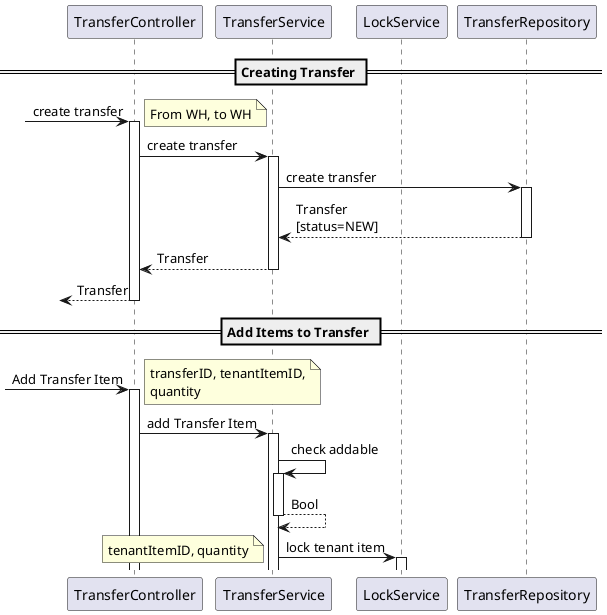

# Create Order

```plantuml

@startuml

participant TransferController as controller
participant TransferService as service
participant LockService
participant TransferRepository as repository

== Creating Transfer ==
?-> controller++: create transfer
note left
    From WH, to WH
end note
controller -> service++: create transfer
service -> repository++: create transfer
repository --> service--: Transfer\n[status=NEW]
service --> controller--: Transfer
?<-- controller--: Transfer

== Add Items to Transfer ==
?-> controller++: Add Transfer Item
note left
    transferID, tenantItemID,
    quantity
end note
controller -> service++: add Transfer Item
service -> service++: check addable
service --> service--: Bool
service -> LockService++: lock tenant item
note left
    tenantItemID, quantity
end note

@enduml
```
