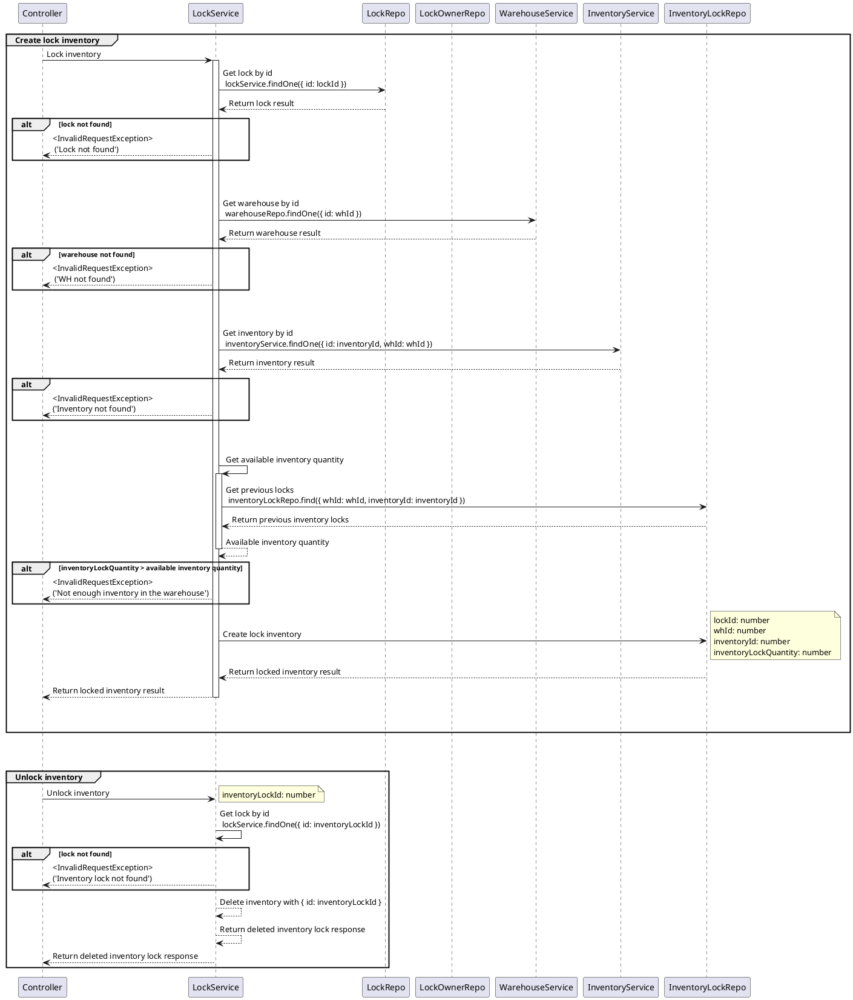

##### Inventory receive - Lock inventory sequence diagram 

```plantuml
@startuml

participant "Controller" as controller
participant "LockService" as lockService
participant "LockRepo" as lockRepo
participant "LockOwnerRepo" as lockOwnerRepo
participant "WarehouseService" as warehouseService
participant "InventoryService" as inventoryService
participant "InventoryLockRepo" as inventoryLockRepo

group Create lock inventory
    controller -> lockService ++: Lock inventory

    lockService -> lockRepo: Get lock by id \n lockService.findOne({ id: lockId })
    
    lockRepo --> lockService: Return lock result

    alt lock not found
        lockService --> controller: <InvalidRequestException> \n ('Lock not found')
    end

    |||
    |||

    lockService -> warehouseService: Get warehouse by id \n warehouseRepo.findOne({ id: whId })

    warehouseService --> lockService: Return warehouse result

    alt warehouse not found
        lockService --> controller: <InvalidRequestException> \n ('WH not found')
    end


    |||
    |||

    lockService -> inventoryService: Get inventory by id \n inventoryService.findOne({ id: inventoryId, whId: whId })

    inventoryService --> lockService: Return inventory result

    alt
        lockService --> controller: <InvalidRequestException> \n('Inventory not found')
    end


    |||
    |||

    ' lockService -> inventoryLockRepo: inventoryLockRepo.findOne({ whId: whId, inventoryId: inventoryId })
    ' inventoryLockRepo --> lockService: InventoryLock

    ' inventoryLockRepo --> lockService: InventoryLocks 

    lockService -> lockService ++: Get available inventory quantity
    lockService -> inventoryLockRepo: Get previous locks \n inventoryLockRepo.find({ whId: whId, inventoryId: inventoryId })
    inventoryLockRepo --> lockService: Return previous inventory locks
    lockService --> lockService --: Available inventory quantity

    alt inventoryLockQuantity > available inventory quantity
        lockService --> controller: <InvalidRequestException> \n('Not enough inventory in the warehouse')
    end

    lockService -> inventoryLockRepo: Create lock inventory

    note right
        lockId: number
        whId: number
        inventoryId: number
        inventoryLockQuantity: number
    end note

    inventoryLockRepo --> lockService: Return locked inventory result

    lockService --> controller --: Return locked inventory result

    |||
    |||
end

|||
|||

group Unlock inventory
    controller -> lockService: Unlock inventory

    note right
        inventoryLockId: number
    end note

    lockService -> lockService: Get lock by id \n lockService.findOne({ id: inventoryLockId })

    alt lock not found
        lockService --> controller: <InvalidRequestException> \n('Inventory lock not found')
    end

    lockService --> lockService: Delete inventory with { id: inventoryLockId }

    lockService --> lockService: Return deleted inventory lock response

    lockService --> controller: Return deleted inventory lock response
end

@enduml
```