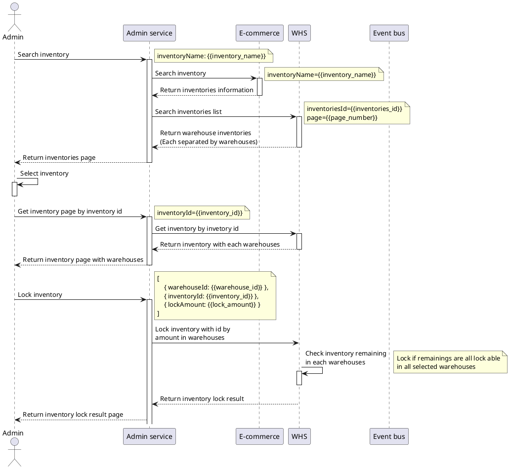

### Inventory lock sequence diagram 

```plantuml

@startuml
actor "Admin" as admin
participant "Admin service" as adminService
participant "E-commerce" as ecom
participant "WHS" as whs
participant "Event bus" as eb

!$lockedStatus = "LOCKED"
!$lockRequestStatus = "LOCKED"


admin -> adminService ++: Search inventory
note right
    inventoryName: {{inventory_name}}
end note
adminService -> ecom ++: Search inventory
note right
    inventoryName={{inventory_name}}
end note
ecom --> adminService--: Return inventories information


adminService -> whs ++: Search inventories list
note right
    inventoriesId={{inventories_id}}
    page={{page_number}}
end note
whs --> adminService --: Return warehouse inventories \n(Each separated by warehouses)
adminService --> admin --: Return inventories page

admin -> admin ++--: Select inventory

admin -> adminService ++: Get inventory page by inventory id
note right
    inventoryId={{inventory_id}}
end note
adminService -> whs ++: Get inventory by invetory id
whs --> adminService --: Return inventory with each warehouses
adminService --> admin --: Return inventory page with warehouses

admin -> adminService ++: Lock inventory
note right
    [
        { warehouseId: {{warehouse_id}} },
        { inventoryId: {{inventory_id}} },
        { lockAmount: {{lock_amount}} }
    ]
end note
adminService -> whs: Lock inventory with id by \namount in warehouses
whs -> whs ++--: Check inventory remaining \nin each warehouses
note right
    Lock if remainings are all lock able
    in all selected warehouses
end note
whs --> adminService: Return inventory lock result
adminService --> admin: Return inventory lock result page

@enduml
```