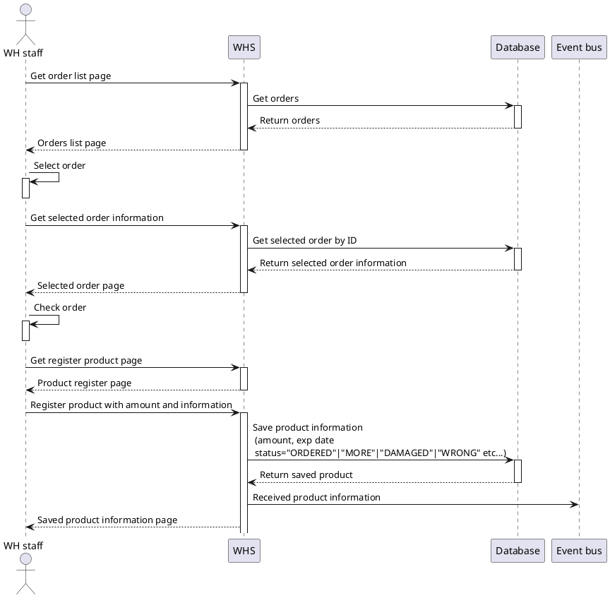

### Product receive sequence diagram 

```plantuml

@startuml
actor "WH staff" as staff
participant "WHS" as whs
participant "Database" as db
participant "Event bus" as eb

staff -> whs ++: Get order list page
whs -> db ++: Get orders
db --> whs --: Return orders
whs --> staff --: Orders list page

staff -> staff ++--: Select order

staff -> whs ++: Get selected order information
whs -> db ++: Get selected order by ID
db --> whs --: Return selected order information
whs --> staff --: Selected order page

staff -> staff ++--: Check order

staff -> whs ++: Get register product page
whs --> staff --: Product register page

staff -> whs++: Register product with amount and information
whs -> db ++: Save product information \n (amount, exp date \n status="ORDERED"|"MORE"|"DAMAGED"|"WRONG" etc...)

db --> whs --: Return saved product
whs -> eb: Received product information
whs --> staff: Saved product information page

@enduml
```