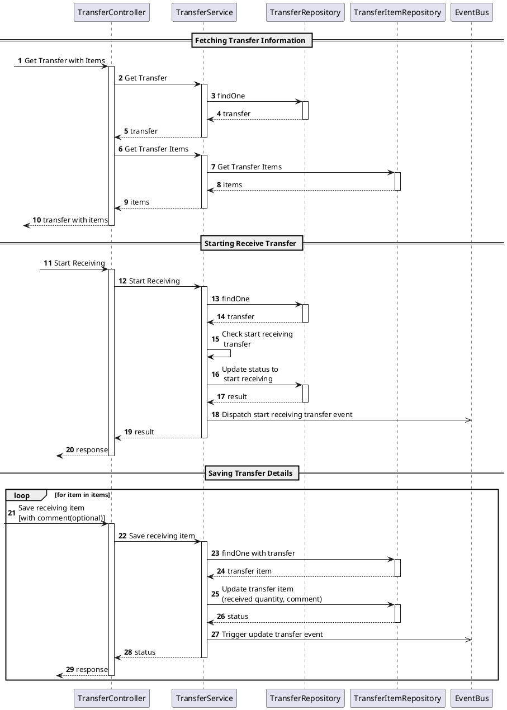

# Receiving Transfer

```plantuml
@startuml
autonumber

participant TransferController
participant TransferService
participant TransferRepository
participant TransferItemRepository
participant EventBus

== Fetching Transfer Information ==
?-> TransferController++: Get Transfer with Items
TransferController -> TransferService++: Get Transfer
TransferService -> TransferRepository++: findOne
TransferRepository --> TransferService--: transfer
TransferService --> TransferController--: transfer
TransferController -> TransferService++: Get Transfer Items
TransferService -> TransferItemRepository++: Get Transfer Items
TransferItemRepository --> TransferService--: items
TransferService --> TransferController--: items
?<-- TransferController--: transfer with items

== Starting Receive Transfer ==
?-> TransferController++: Start Receiving
TransferController -> TransferService++: Start Receiving
TransferService -> TransferRepository++: findOne
TransferRepository -->TransferService--: transfer
TransferService -> TransferService: Check start receiving\n transfer
TransferService -> TransferRepository++: Update status to\n start receiving
TransferRepository --> TransferService--: result
TransferService ->> EventBus: Dispatch start receiving transfer event
TransferService --> TransferController--: result
?<-- TransferController--: response

== Saving Transfer Details ==
loop for item in items
    ?-> TransferController++: Save receiving item \n[with comment(optional)]
    TransferController -> TransferService++: Save receiving item
    TransferService -> TransferItemRepository++: findOne with transfer
    TransferItemRepository --> TransferService--: transfer item
    TransferService -> TransferItemRepository++: Update transfer item\n(received quantity, comment)
    TransferItemRepository --> TransferService--: status
    TransferService ->> EventBus: Trigger update transfer event
    TransferService --> TransferController--: status
    ?<-- TransferController--: response
end
@enduml
```
