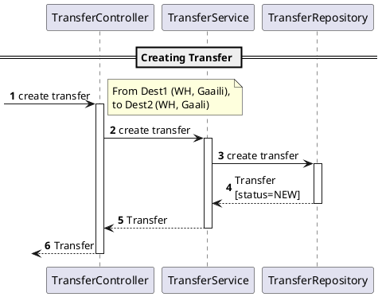

# Transfer

```plantuml

@startuml


participant TransferController as controller
participant TransferService as service
participant TransferRepository as repository

== Creating Transfer ==
autonumber
?-> controller++: create transfer
note left
    From Dest1 (WH, Gaaili),
    to Dest2 (WH, Gaali)
end note
controller -> service++: create transfer
service -> repository++: create transfer
repository --> service--: Transfer\n[status=NEW]
service --> controller--: Transfer
?<-- controller--: Transfer
@enduml
```
