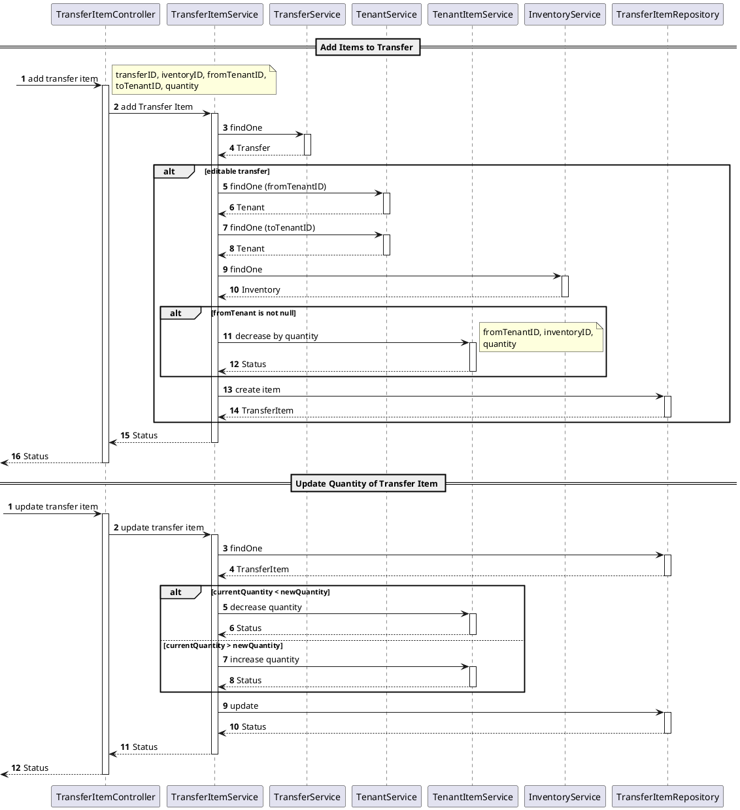

# Transfer Item

```plantuml

@startuml


participant TransferItemController as controller
participant TransferItemService as service
participant TransferService
participant TenantService
participant TenantItemService
participant InventoryService
participant TransferItemRepository as repository

== Add Items to Transfer ==
autonumber
?-> controller++: add transfer item
note left
    transferID, iventoryID, fromTenantID,
    toTenantID, quantity
end note
controller -> service++: add Transfer Item
service -> TransferService++: findOne
return Transfer
alt editable transfer
    service -> TenantService++: findOne (fromTenantID)
    return Tenant
    service -> TenantService++: findOne (toTenantID)
    return Tenant
    service -> InventoryService++: findOne
    return Inventory
    alt fromTenant is not null
        service -> TenantItemService++: decrease by quantity
        note right
            fromTenantID, inventoryID,
            quantity
        end note
        TenantItemService --> service--: Status
    end alt
    service -> repository++: create item
    return TransferItem
end alt
return Status
return Status

== Update Quantity of Transfer Item ==
autonumber
?-> controller++: update transfer item
controller -> service++: update transfer item
service -> repository++: findOne
return TransferItem

alt currentQuantity < newQuantity
    service -> TenantItemService++: decrease quantity
    return Status
else currentQuantity > newQuantity
    service -> TenantItemService++: increase quantity
    return Status
end alt

service -> repository++: update
return Status

return Status
return Status

@enduml
```
