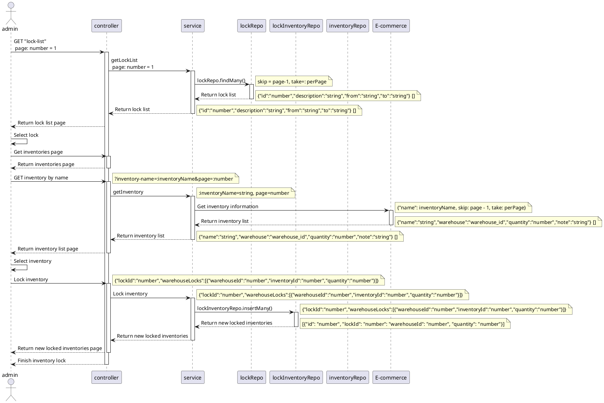

### Warehouse inventory lock sequence diagram 

```plantuml

@startuml
actor admin
participant controller
participant service
participant lockRepo
participant lockInventoryRepo
participant inventoryRepo
participant "E-commerce" as ecom

!$getMethod="GET"
!$patchMethod="PATCH"
!$postMethod="POST"
!$lockDto={ "description": "string", "from": "string", "to": "string" }
!$editLockDto={ "id": "number", "description": "string", "from": "string", "to": "string" }
!$createdLock={ "id": "number", "description": "string", "from": "string", "to": "string" }
!$inventoryDto={ "name": "string", "warehouse": "warehouse_id", "quantity": "number", "note": "string" }
!$lockInventoryDto={ "lockId": "number", "warehouseLocks": [{"warehouseId": "number", "inventoryId": "number", "quantity": "number"}] }

admin -> controller ++: $getMethod "lock-list"\n page: number = 1
controller -> service ++: getLockList\n page: number = 1
service -> lockRepo ++: lockRepo.findMany()
note right: skip = page-1, take=: perPage
lockRepo --> service --: Return lock list
note right: $editLockDto []
service --> controller --: Return lock list
note right: $editLockDto []
controller --> admin: Return lock list page

admin -> admin: Select lock

admin -> controller ++: Get inventories page
controller --> admin --: Return inventories page

admin -> controller ++: $getMethod inventory by name
note right: ?inventory-name=:inventoryName&page=:number 
controller -> service ++: getInventory
note right: :inventoryName=string, page=number
service -> ecom ++: Get inventory information
note right: {"name": inventoryName, skip: page - 1, take: perPage}
ecom --> service --: Return inventory list
note right: $inventoryDto []
service --> controller --: Return inventory list
note right: $inventoryDto []
controller --> admin --: Return inventory list page

admin -> admin: Select inventory

admin -> controller ++: Lock inventory
note right: $lockInventoryDto
controller -> service ++: Lock inventory
note right: $lockInventoryDto
service -> lockInventoryRepo ++: lockInventoryRepo.insertMany()
note right: $lockInventoryDto
lockInventoryRepo --> service --: Return new locked inventories
note right: [{"id": "number", "lockId": "number": "warehouseId": "number", "quantity": "number"}]
service --> controller --: Return new locked inventories
controller --> admin --: Return new locked inventories page
controller --> admin --: Finish inventory lock


' ||100||

' admin -> controller ++: $getMethod create lock page
' controller --> admin --: Return create lock page
' admin -> controller ++: $postMethod lock
' note right: $lockDto

' ||100||

' controller -> service ++: createLock
' note right: $lockDto
' service -> lockRepo ++: lockRepo.create()
' note right: $lockDto
' lockRepo --> service --: new created lock
' note right: $createdLock
' service --> controller --: new created lock
' note right: $createdLock
' controller --> admin --: new created lock result page

' ||100||

' admin -> controller ++: $patchMethod update lock "lock/:id"
' note right: lockId: number $lockDto
' controller -> service ++: Get lock information
' note right: lockId: number $editLockDto
' service -> lockRepo ++: lockRepo.update()
' note right: lockId: number $editLockDto
' lockRepo --> service --: Return lock information
' note right: $editLockDto
' service --> controller --: Return lock information
' note right: $editLockDto
' controller --> admin --: Return lock edit page
' note right: $editLockDto

@enduml
```