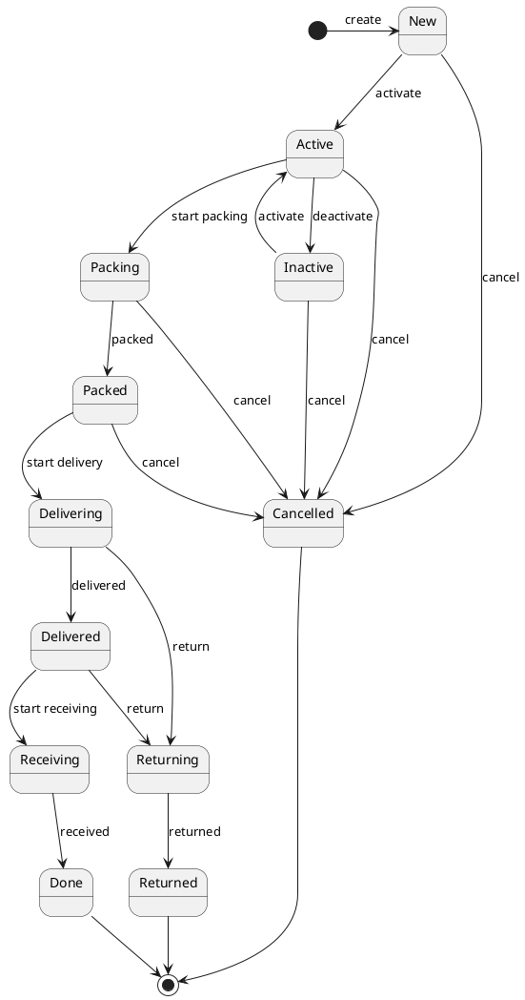

# Transfer State Diagram

```plantuml

@startuml
[*] -> New: create
New --> Active: activate
Active --> Inactive: deactivate
Inactive --> Active: activate
Active --> Packing: start packing
Packing --> Packed: packed
Packed --> Delivering: start delivery
Delivering --> Delivered: delivered
Delivered --> Receiving: start receiving
Receiving --> Done: received

New --> Cancelled: cancel
Inactive --> Cancelled: cancel
Active --> Cancelled: cancel
Packing --> Cancelled: cancel
Packed --> Cancelled: cancel
Cancelled --> [*]

Delivering --> Returning: return
Delivered --> Returning: return

Returning --> Returned: returned
Returned --> [*]

Done --> [*]

@enduml

```
