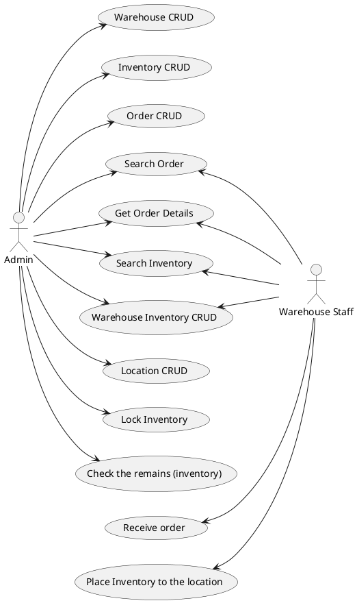

# Use Case

```plantuml
@startuml
left to right direction

usecase  (Warehouse CRUD) as wh_crud
usecase  (Inventory CRUD) as inventory_crud
usecase  (Order CRUD) as order_crud
usecase  (Search Order) as search_order
usecase  (Get Order Details) as get_order_details
usecase  (Receive order) as receive_order
usecase  (Search Inventory) as search_inventory
usecase  (Warehouse Inventory CRUD) as wh_inventory_crud
usecase  (Location CRUD) as location_crud
usecase  (Place Inventory to the location) as placing_inventory
usecase  (Lock Inventory) as lock_inventory
usecase  "Check the remains (inventory)" as check_inventory_remains
actor Admin
actor "Warehouse Staff" as staff

Admin --> wh_crud
Admin --> inventory_crud
Admin --> check_inventory_remains
Admin --> wh_inventory_crud
Admin --> location_crud
Admin --> lock_inventory
Admin --> search_inventory
Admin --> search_order
Admin --> order_crud
Admin --> get_order_details

placing_inventory <-- staff
wh_inventory_crud <-- staff
search_inventory <-- staff
receive_order <-- staff
search_order <-- staff
get_order_details <-- staff


@enduml
```
